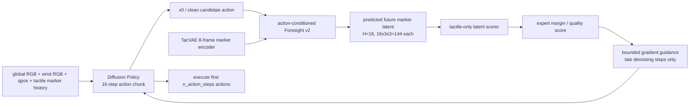
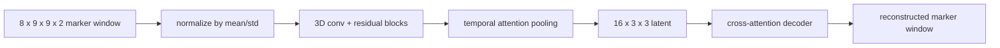
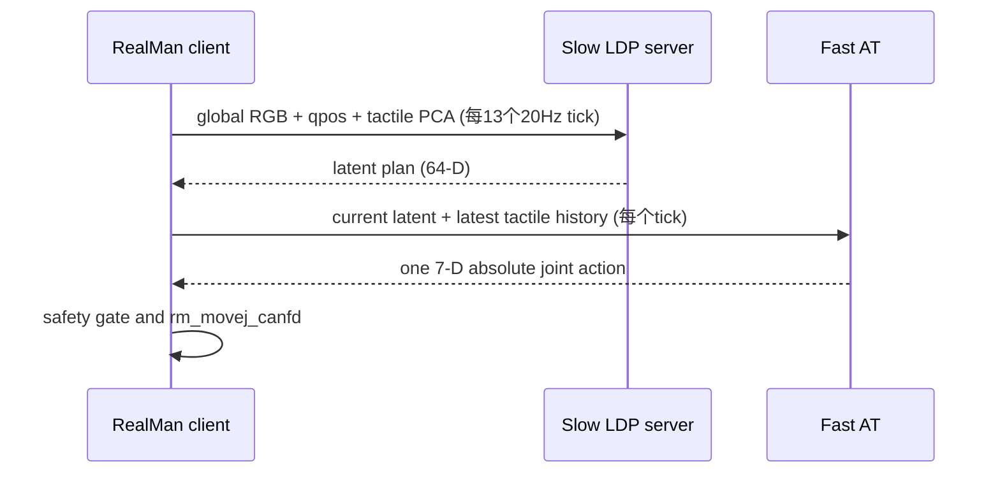

# ForeTac 完整训练、部署与推理链路

> 文档日期：2026-09-03  
> 仓库：`/home/chenshuai/Project/TactileACT-cs`，分支 `tacfore`  
> 目标：记录 TacVAE、Foresight、触觉质量评分器、DP/RDP 的 checkpoint、数据契约、训练参数、推理算法、部署命令、历史问题和复现边界。

<callout emoji="warning" background-color="light-yellow" border-color="orange">
本机当前未挂载 `/media/chenshuai/EXTERNAL_USB`，因此文档中的外接盘数据路径只能作为数据来源记录，不能在当前机器直接重跑。训练输出和 checkpoint 位于 `/home/chenshuai/Project/output` 或仓库 `outputs` 时可以读取。不要把“文件存在”误解为“依赖数据仍可用”。
</callout>

## 1. 先给结论：版本与推荐链路

### 1.1 按时间最新的模型

| 模块 | 时间最新的本地文件 | 训练状态 | 说明 |
|---|---|---|---|
| 多任务 TacVAE | `outputs/multitask_tacvae_5task_20260804/train/best_macro.pt` | epoch 300，`best_macro_mse=0.0075224` | 五任务共享模型，任务顺序 board/vase/card/chip/socket；不是自动兼容 Board ForeTac 的单任务后果模型 |
| Board TacVAE | `/home/chenshuai/Project/output/tactile_vae_v2_no_intensity_rank_board_260609_260610_left_tw8_ld16_s2_e150/best_tactile_vae_v2.pt` | epoch 150，`val_loss=0.00083044` | 2026-08-20；no-intensity/rank supervision 消融版本，和最新 no-intensity Foresight/scorer 身份一致 |
| Board Foresight | `/home/chenshuai/Project/output/foresight_ckpt/v2_no_intensity_rank_board_action_conditioned_h16_e100_20260820/foresight_best.ckpt` | 100 epoch 训练输出 | 2026-08-20；action-conditioned，H=16，stride=1 |
| Board scorer | `/home/chenshuai/Project/output/v2_intensity_rank_scorer_ablation_20260820/without_intensity_ranking/board_latent_energy_best.pt` | checkpoint `epoch=0` 字段是训练入口保存约定，不代表只训练 0 epoch | schema v2 tactile-only latent scorer，和 no-intensity TacVAE identity 一致 |
| Board DP | `/home/chenshuai/Project/output/dp_tac_concat_board_260609_260610_left_boardvae_rawimg200x266_ph16_oh2_action_offset6_visaug_e1000/dp_best.pth` | epoch 226，global step 29056，val loss 0.00361016 | 2026-06-24；当前本地可读取的 Board concat DP，含 EMA、双相机和视觉增强 |
| Board RDP LDP | `/home/chenshuai/Project/output/rdp_reactive/caheiban_joint_left_20hz/20260729_143158_full/stage2_ldp/checkpoints/latest.ckpt` | full RDP Stage 2 | 独立的 reactive diffusion policy 对比链路，不是 ForeTac guidance checkpoint |

### 1.2 当前建议的严格配套组合

最新 no-intensity/rank 组合的 identity 关系为：

```text
Board TacVAE no-intensity/rank
  -> action-conditioned Foresight v2 no-intensity/rank
  -> tactile-only latent scorer without-intensity-ranking
```

DP 作为动作候选生成器，内部可以继续使用它训练时冻结的 TacVAE encoder；在线后果分支使用 Foresight `args.json` 指定的 TacVAE。两者不要求必须是同一个 checkpoint，但动作空间、触觉 latent 形状和时间定义必须一致。

完整在线链路：



<callout emoji="bulb" background-color="light-blue" border-color="blue">
正式 scorer 唯一输入是 Foresight 预测的 marker latent。它不接收 action、RGB、qpos、EEF、force、task id、raw marker 或 decoded marker。梯度路径固定为 `candidate action -> Foresight -> predicted tactile latent -> scorer`。旧 action-aware scorer 只能在显式 `legacy_ablation=true` 的消融路径使用。
</callout>

### 1.3 Full V2 与 no-intensity/rank V2 的取舍

另有严格配套的 Full V2 组合：

```text
/home/chenshuai/Project/output/tactile_vae_v2_board_260609_260610_left_tw8_ld16_s2_e150/best_tactile_vae_v2.pt
/home/chenshuai/Project/output/foresight_ckpt/v2_board_action_conditioned_h16_e100_20260820/foresight_best.ckpt
/home/chenshuai/Project/output/v2_intensity_rank_scorer_ablation_20260820/full_v2/board_latent_energy_best.pt
```

- Full V2 参数：intensity weight 为 0.1，rank weight 为 0.05。
- 同一 held-out Board Foresight 评估中，Full V2 raw-marker MAE 比 V1 降低 12.44%，比无监督 V2 降低 3.11%。
- 无监督/no-intensity V2 的 raw reconstruction MAE 略低。
- 复现论文和 2026-08-20 intensity-aware 实验时使用 Full V2；使用最近的 scorer ablation 时使用 no-intensity/rank 组合。
- 两套 VAE、Foresight、scorer 不得交叉拼接。

## 2. 数据集与字段契约

### 2.1 HDF5 episode 结构

每个 episode 通常为 `episode_*.hdf5`，主要字段如下：

| 字段 | 形状/类型 | 用途 |
|---|---|---|
| `observations/images/global` | `(T,H,W,3)` uint8 | 全局 RGB，DP 视觉编码器和 Foresight 视觉上下文 |
| `observations/images/wrist` | `(T,H,W,3)` uint8 | 腕部 RGB，DP 双相机输入 |
| `observations/images/gelsight` | `(T,H,W,3)` 或触觉图像 | Foresight 配置中的 camera name；marker-only 训练时主要使用 marker stream |
| `observations/proprio_joint` | `(T,7)` float32 | 7-D 关节位置，单位按采集协议为 degree |
| `actions/joint_abs` | `(T,7)` float32 | 7-D absolute joint action，和 qpos 同一单位 |
| `observations/tac/left/marker_offset` | `(T,9,9,2)` float32 | 左 GelSight 9x9 marker 的二维偏移；Board 正式后果分支的核心触觉信号 |
| `observations/tac/right/marker_offset` | `(T,9,9,2)` float32 | 多任务 TacVAE manifest 的右侧校验字段 |
| `observations/tac/{left,right}/force6d` 或 `ft` | 任务相关 | 力曲线分析、质量标签诊断；正式 tactile-only scorer 不直接读取 force |

当前多任务 manifest 的完整统计是 88 个 source、6761 个有效 episode、2,887,945 帧；训练/验证拆分为 5407/677 episodes。任务统计：board 979 episodes/832,659 帧，vase 238/96,136，card 393/172,828，chip 42/20,517，socket 5109/1,765,805。Chip 和部分 socket 的窗口总数需要外接盘重新挂载后再 recount。

Board Foresight 的 260609/260610 数据共 221 episodes，按 90%/10% 进行 episode-level split；scorer 的验证集为 2963 个窗口，四类标签为 `expert`、`pressure_too_small`、`pressure_too_large`、`pressure_unstable`。

### 2.2 时间窗口定义

```text
TacVAE:        8-frame marker window, sample_stride=2
Foresight:     current observation + action chunk -> future tactile, H=16
Board v2:      temporal_stride=1, future_offset=1
DP:            pred_horizon=16, obs_horizon=2, execute n_action_steps=8
RDP:           20 Hz control, horizon=32, LDP replan every 13 ticks
```

对 stride-1 Foresight，窗口语义为 `obs[t] + action[t:t+16] -> tactile[t+1:t+16]`。stride-3 旧实验则为 `obs[t] + action[t:t+46:3] -> tactile[t:t+46:3]`，服务端要求 `alignment=none`，不能与 stride-1 scorer 或 dense DP 标签混用。

### 2.3 数据可用性和排除项

- 外接盘路径 `/media/chenshuai/EXTERNAL_USB/...` 当前不可访问。
- RDP Board reproduction 排除 `episode_12.hdf5` 和 `episode_52.hdf5`，因为缺 marker offset，剩余 78 条完整 episode。
- 多任务 TacVAE manifest 要求 HDF5 可打开、左右 marker 长度相等、尾部形状为 `(9,9,2)`、至少 8 帧；force 不是 TacVAE 必需字段。
- 训练前必须固定 manifest hash、episode-level split seed=42 和 normalization 统计，避免重新挂盘后数据漂移。

## 3. TacVAE 训练

### 3.1 Board TacVAE v2 配置

配置文件：`/home/chenshuai/Project/output/tactile_vae_v2_no_intensity_rank_board_260609_260610_left_tw8_ld16_s2_e150/config.json`。

| 参数 | 值 | 含义 |
|---|---:|---|
| `latent_dim` | 16 | 每帧 latent channel 数 |
| latent shape | `16 x 3 x 3` | 展平后 144-D |
| `temporal_window` | 8 | 输入连续 marker 帧数 |
| `sample_stride` | 2 | 相邻训练窗口起点间隔 |
| `decoder_hidden/heads/layers` | 128/4/2 | cross-attention decoder |
| `kl_weight` | 1e-6 | VAE KL 正则 |
| `direction_weight` | 0.2 | marker 方向辅助项 |
| `intensity_weight` | 0.0 | no-intensity/rank 版本关闭 |
| `rank_weight` | 0.0 | no-intensity/rank 版本关闭 |
| `epochs/batch_size` | 150/512 | 训练轮数和 batch |
| `lr/weight_decay` | 1e-4/0 | Adam 类优化器学习率与衰减 |
| `val_ratio/seed` | 0.1/42 | episode/window 验证和随机种子 |
| normalize | true | 使用保存的 marker mean/std |

Full V2 只把 `intensity_weight=0.1`、`rank_weight=0.05` 改为非零，其余配置相同。

### 3.2 网络和损失



训练目标可写为：

```text
L = L_reconstruction + kl_weight * L_KL
    + direction_weight * L_direction
    + intensity_weight * L_intensity
    + rank_weight * L_rank
```

Full V2 的 intensity head 是辅助监督，并不应在论文或部署文档中表述为严格 disentangled representation。已有 probe 结果显示 pattern 分量本身仍含有大量 Fz 信息。

### 3.3 五任务 TacVAE

训练入口：`TFAC_V5/train_multitask_tacvae_5task.py`。配置签名位于 `outputs/multitask_tacvae_5task_20260804/train/run_config.json`。

```bash
cd /home/chenshuai/Project/TactileACT-cs
/home/chenshuai/miniconda3/envs/TactileACT/bin/python -u \
  TFAC_V5/train_multitask_tacvae_5task.py \
  --manifest outputs/multitask_tacvae_5task_20260803/manifest.jsonl \
  --out_dir outputs/multitask_tacvae_5task_20260804/train \
  --epochs 300 --steps_per_epoch 256 --batch_size 500 \
  --eval_batch_size 2048 --window_stride 2 --val_window_stride 8 \
  --latent_channels 5 --inr_hidden 64 --kl_weight 1e-6 \
  --lr 1e-4 --weight_decay 1e-5 --grad_clip 1.0 \
  --patience 30 --seed 42 --num_workers 4 --eval_num_workers 4 \
  --device cuda
```

checkpoint 根字段包括：model state、optimizer state、normalization statistics、训练签名、manifest hash、completed epoch 和完整 history。

- `best_macro.pt`：验证 macro MSE 最优，优先用于推理。
- `latest.pt`：最后完成的 epoch，主要用于继续训练。

## 4. Foresight 训练

### 4.1 训练入口与配置

入口：`TFAC_V5/pretrain_latent_foresight_multistep.py`。推荐配置文件：

```text
TFAC_V5/config_pretrain_foresight_board_multistep16_boardvae_marker_only.json
TFAC_V5/config_pretrain_foresight_board_multistep16_boardvae_marker_only_temporalstride3.json
```

最新 v2 的 `args.json` 关键参数：

| 参数 | 值 |
|---|---:|
| `hidden_dim` | 512 |
| `batch_size/num_epochs` | 16/100 |
| `chunk_size`, `foresight_horizon`, `predict_horizon` | 16/16/16 |
| `future_offset/action_offset` | 1/0 |
| `temporal_stride` | 1 |
| `history_len` | 1 |
| `lr/weight_decay` | 4e-5/1e-4 |
| `foresight_layers/nheads/feedforward` | 3/8/2048 |
| `dropout` | 0.1 |
| `tactile_mode` | marker |
| `lambda_marker/lambda_delta/final_weight` | 0.3/0.5/1.0 |
| `grad_clip` | 1.0 |
| `samples_per_episode` | 30 |
| `trajectory_conditioning` | `future_action_chunk` |
| `num_episodes` | 221 |

训练命令示例：

```bash
cd /home/chenshuai/Project/TactileACT-cs
bash scripts/train/train_foresight_board_multistep16.sh
```

Foresight 的监督目标是 latent prediction、marker reconstruction 和 temporal delta 的加权和：

```text
L_foresight = L_latent + 0.3 * L_marker + 0.5 * L_delta
```

TacVAE 在 Foresight 训练中冻结；Foresight 接收当前 RGB/状态上下文与 future action chunk，输出 H=16 个未来 marker latent。Foresight checkpoint 是纯 `state_dict` OrderedDict，不包含 optimizer；配置和 normalization 在同目录 `args.json` 中。

### 4.2 架构细节

```text
RGB backbone -> vision projection
qpos -> proprio projection
future action chunk (16 x 7) -> action projection + positional embedding
current tactile history -> frozen TacVAE -> 144-D latent projection
factorized spatial/temporal attention -> 16 parallel future queries
future tactile head -> 16 x 144 latent prediction
```

Foresight checkpoint 内还包含冻结 TacVAE decoder/encoder 权重、视觉 ResNet、3 层 attention blocks、future query/time/spatial embeddings。加载时必须根据 `tactile_vae_version=v2` 实例化 `TactileVAEv2`，并使用 `strict=True`；历史代码曾把 V2 checkpoint 静默实例化成 V1，这是已修复的问题。

## 5. Tactile-only Contact-quality Scorer

### 5.1 正式输入和标签

训练入口在 `TFAC_V5/tac_quality_energy`，当前 schema v2 checkpoint：

```text
/home/chenshuai/Project/output/v2_intensity_rank_scorer_ablation_20260820/without_intensity_ranking/board_latent_energy_best.pt
```

输入是 Foresight 生成的单个 future latent chunk：`(B,H,144)`，H=16。训练数据按四类目录构造：

```text
expert             <- wipe_pos_straight_z124_125_150_20260609
pressure_too_small <- z_too_high
pressure_too_large <- z_too_low
pressure_unstable  <- z_too_oscillate
```

虽然历史目录名存在“intensity rank”，正式 scorer 只使用 tactile latent。checkpoint metadata 记录 `schema_version=2`、`task=board`、`latent_shape=[144]`、`horizon=16`、`temporal_stride=1`、`future_offset=1` 和 TacVAE SHA256 identity。

### 5.2 模型和损失参数

| 参数 | 值 |
|---|---:|
| `embed_dim/hidden` | 128/256 |
| `dropout` | 0.1 |
| `temperature` | 0.1 |
| `lr/weight_decay` | 3e-4/1e-4 |
| `epochs/batch_size` | 40/128 |
| `margin/margin_weight` | 0.25/0.5 |
| `chunk_len/stride` | 16/8 |
| `val_ratio` | 0.2 |
| `balanced_sampler` | true |
| `contact_quantile/min_contact_ratio` | 0.5/0.25 |

模型可理解为 latent encoder + 4 类 prototype logits。部署时主要使用 `expert_margin`：expert logit 与负类竞争分数的差值越高，代表越接近专家触觉质量。

### 5.3 已有验证结果及边界

最新 no-intensity scorer 在 2963 个 validation windows 上 `acc=1.0`、`macro_f1=1.0`、expert-vs-negative AUROC=1.0、gradient finite rate=1.0；Full V2 scorer 也得到同样的饱和结果。因为采集条件标签容易分离，这些数字只能证明当前 split 的分类和梯度链路有效，不能直接等同于真机成功率提升。离线 guidance 仍需要 real rollout 或 counterfactual 数据验证。

## 6. DP 训练与推理

### 6.1 Board concat DP 配置

配置：`/home/chenshuai/Project/output/dp_tac_concat_board_260609_260610_left_boardvae_rawimg200x266_ph16_oh2_action_offset6_visaug_e1000/config.json`。

| 参数 | 值 |
|---|---:|
| cameras | `global,wrist` |
| action/proprio dim | 7/7 |
| tactile history | 8 frames |
| image resize/crop | 200x266 / 200x266 |
| `pred_horizon/obs_horizon/n_action_steps` | 16/2/8 |
| `action_offset` | 6 |
| diffusion train/inference steps | 100/100 |
| U-Net `down_dims` | 512, 1024, 2048 |
| `diffusion_step_embed_dim` | 128 |
| epochs/batch/lr | 1000/64/1e-4 |
| EMA | enabled |
| max train/val windows | 8192/1024 |
| visual enhancement | gamma 0.85, contrast 1.3, brightness 0.03 |
| visual augmentation | brightness 0.15, contrast 0.2, gamma 0.15, noise 0.01, erase p 0.08 |

DP 的 conditioning 维度为：

```text
(512 global + 512 wrist + 144 tactile latent + 7 qpos) * obs_horizon 2 = 2350
```

其中 144-D 触觉输入由冻结 TacVAE encoder 输出。`action_offset=6` 表示窗口从观测时刻之后偏移 6 个 frame 取 action，必须与训练脚本、服务端和评估脚本同时保持一致。

训练入口：

```bash
bash scripts/train/train_dp_tac_concat_board_260609_260610_action_offset6_vision_aug.sh
```

### 6.2 DP denoising

给定 observation condition，DDPM/DDIM 从噪声动作序列开始迭代：

```text
x_N ~ Normal(0, I)
for k = N ... 1:
    eps = U-Net(x_k, timestep=k, condition)
    x_{k-1} = scheduler.step(eps, k, x_k)
return x_0[:, :n_action_steps]
```

离线 ForeTac guidance 在后期去噪步骤对 `x0` 或 late sample 建立梯度，不重新训练 DP。当前效率实验的 RTX 4090 统计：DP 132.46 ms，DP+Foresight 134.98 ms，DP+Foresight+scorer 135.35 ms，10-step gradient guidance 261.26 ms；完整 ForeTac 比基础 DP 增加约 128.80 ms。

## 7. ForeTac 在线 guidance 推理

### 7.1 目标函数

对 DP 当前候选动作 `a`：

```text
z_future = Foresight(obs, tactile_history, a)
s = scorer(z_future)
g = d s / d a
```

将梯度归一化并限制在 trust region 内：

```text
g_hat = g / max(||g||, min_grad_norm)
delta = clip(scale * g_hat, max_delta_norm)
a_guided = a + delta
```

正式服务只在最后若干 diffusion denoising steps 执行，并重新计算 score；若 score 未改善或动作超出 trust region，则拒绝更新，继续使用原始 DP proposal。生产默认参考参数：`score_mode=expert_margin`、`alignment=none`、`guidance_scale=0.003`、`guidance_steps=5`、`normalize_guidance_grad`、`max_grad_norm=5.0`。

### 7.2 Board 服务端启动

服务端：`for_show_xiaomi/serve_board_dp_foresight_guided.py`。下面是使用最新 no-intensity/rank 组合的示例；如果切换 Full V2，三个 VAE/Foresight/scorer 路径必须整体切换。

```bash
cd /home/chenshuai/Project/TactileACT-cs
CUDA_VISIBLE_DEVICES=0 python -u -m for_show_xiaomi.serve_board_dp_foresight_guided \
  --arm latent_energy_guided \
  --dp_ckpt /home/chenshuai/Project/output/dp_tac_concat_board_260609_260610_left_boardvae_rawimg200x266_ph16_oh2_action_offset6_visaug_e1000/dp_best.pth \
  --foresight_dir /home/chenshuai/Project/output/foresight_ckpt/v2_no_intensity_rank_board_action_conditioned_h16_e100_20260820 \
  --foresight_ckpt /home/chenshuai/Project/output/foresight_ckpt/v2_no_intensity_rank_board_action_conditioned_h16_e100_20260820/foresight_best.ckpt \
  --scorer_ckpt /home/chenshuai/Project/output/v2_intensity_rank_scorer_ablation_20260820/without_intensity_ranking/board_latent_energy_best.pt \
  --host 0.0.0.0 --port 8769 --gpu 0 \
  --num_inference_steps 100 \
  --score_mode expert_margin --alignment none \
  --guidance_steps 5 --guidance_scale 0.003 \
  --normalize_guidance_grad --max_grad_norm 5.0 \
  --action_skip 0 --action_horizon 8 --max_timesteps 2000 \
  --send_guidance_report
```

基线服务仅增加 `--disable_guidance` 并使用另一个端口（例如 8765）。客户端使用：

```bash
python for_show_xiaomi/ws_client.py --host SERVER_IP --port 8769 --disable_force_log
```

服务端输入应包含当前 global/wrist 图像、7-D qpos、左侧 marker history 和协议序号；返回 7-D absolute joint action。部署前必须检查 server log 中的 checkpoint identity、shape、stride、offset 和 `missing=0/unexpected=0`。

### 7.3 视觉/触觉同步

- 采集端保持 global、wrist、marker、qpos、action 的同一 frame index。
- 当前网页展示使用过 748 帧、24 fps 的 Board 视频；视频同步不代表机器人控制频率。
- 训练 DP 的图像预处理必须与 checkpoint config 相同：RGB -> `[0,1]` -> ImageNet normalize -> resize/crop。
- marker history 先按 TacVAE 保存的 mean/std 归一化，再取最后帧或 temporal aggregation latent；不可直接把 raw marker 喂给 scorer。

## 8. RDP 对比链路

RDP 用于 reactive baseline，不应和 ForeTac guidance 混为一谈：



RDP reproduction 参数：20 Hz、horizon 32、LDP 每 13 tick replan（约 1.54 Hz）、DDIM 8 steps；AT 每 tick 解码，不执行 action chunk。Stage 1 AT checkpoint 和 Stage 2 LDP checkpoint 位于：

```text
/home/chenshuai/Project/output/rdp_reactive/caheiban_joint_left_20hz/20260729_143158_full/stage1_at/checkpoints/latest.ckpt
/home/chenshuai/Project/output/rdp_reactive/caheiban_joint_left_20hz/20260729_143158_full/stage2_ldp/checkpoints/latest.ckpt
```

启动和安全测试文档：`for_show_xiaomi/RDP_REALMAN_DEPLOYMENT.md`、`for_show_xiaomi/RDP_REALMAN_RUNBOOK.md`。首次上机器人必须 hold-only，随后低速、小范围，再做正式 rollout；离线 replay 不等于真机安全验证。

## 9. PI0.5 / Pi0-TacForesight 部署链路

### 9.1 当前资产状态与历史口径

PI0.5 方案按“已经完成过集成设计和训练流程”的历史项目记录，但当前机器缺少可直接发布的任务微调 checkpoint 和正式启动脚本。仓库中的 `pi0_tactile/` 是实现依据，包含模型封装、数据适配、Tactile prefix、Foresight auxiliary loss、Flow Matching guidance、score bridge、WebSocket 服务原型和 smoke test。

目前可确认的基础权重是：

```text
/home/chenshuai/Project/output/pi0_checkpoints/pi0_base_pytorch/model.safetensors
/home/chenshuai/Project/output/pi0_checkpoints/pi0_base_pytorch/config.json
```

这套文件是由 OpenPI/JAX 权重转换得到的 PyTorch base 权重，不等同于已经针对 Board/Chip/Vase 微调的 PI0.5-TacForesight checkpoint。当前缺失的发布文件包括：

- 任务微调后的 `pi0_tactile` checkpoint（通常应包含 `checkpoint.pth`、`config.json` 和 optimizer/step 元数据）；
- 与当前 checkpoint 固定绑定的正式启动脚本、环境锁定文件和 robot-side client release；
- 真实 PI0.5 action horizon、tokenizer、相机预处理和真机 rollout 的最终签名。

因此下面的内容是 PI0.5 的完整部署设计和恢复步骤；运行前必须把占位路径替换为实际任务 checkpoint，并完成 openpi 环境验证。

### 9.2 PI0.5 与 ForeTac 的总体关系

PI0.5 使用视觉+语言前缀和 action expert 进行连续 flow matching。ForeTac 不替换 PI0.5 的主生成器，而是在 PI0.5 的 flow sampling 后几步，把当前 clean-action estimate 送入我们的后果分支：

```mermaid
flowchart LR
    I[global RGB + wrist RGB] --> P[PI0.5 PaliGemma vision tokens]
    L[language instruction] --> P
    Q[7-D qpos] --> A[PadStatesAndActions\n7D -> 32D model space]
    T[8-frame left marker history] --> V[TacVAE encoder\n16x3x3 -> 9 tactile tokens]
    P --> F[PI0.5 flow/action expert]
    L --> F
    A --> F
    V --> F
    F --> VT[velocity v_t]
    XT[flow state x_t] --> C[clean estimate x0 = x_t - t*v_t]
    VT --> C
    C --> R[robot slice x0[..., :7]]
    R --> FS[action-conditioned Foresight]
    FS --> Z[predicted future marker latent\nH=16, 144-D]
    Z --> S[tactile-only scorer]
    S --> G[late flow-step gradient guidance]
    G --> XT
    G --> E[execute only first 7-D action slice]
```

关键区别：DP 的指导点在 DDPM denoising sample；PI0.5 的指导点在 flow ODE 的 `x_t`。PI0.5 仍然使用自己的速度场 `v_t` 完成积分，ForeTac 只对后几步的 `x_t` 做有界提议。

### 9.3 模型和 action 维度契约

仓库实现通过 `Pi0ActionAdapter` 兼容 PI0.5 常见的 32-D model action space 与当前机器人 7-D joint action：

| 张量/参数 | PI0.5 约定 | ForeTac/机器人约定 |
|---|---:|---:|
| `config.action_dim` | 32 | PI0.5 flow state 最后一维 |
| `config.robot_action_dim` | 7 | 可执行、可评分的关节维度 |
| `action_horizon` | 20（当前 wrapper 默认） | 需与最终 PI0.5 checkpoint 的 horizon 一致 |
| qpos/action 输入 | pad 到 32D | 数据集原始为 7D |
| scorer/Foresight 输入 | 不读取 padded dims | 只读取前 7D |
| 执行动作 | 不执行 padded dims | 只发送 `[..., :7]` |

7D action 通过零填充进入 PI0.5，guidance mask 只在前 7 个维度为 1；后 25 个 padded dimensions 不参与 scorer、不接收 guidance gradient，也不会发送给机器人。`model_action_dim`、`robot_action_dim`、`action_horizon` 任一不一致都应在加载时直接报错。

### 9.4 PI0.5 的训练流程

入口：`pi0_tactile/train.py`；配置：`pi0_tactile/config.py`；数据适配：`pi0_tactile/dataset.py`。

训练阶段按以下顺序恢复：

1. 加载 OpenPI 的 PI0/PI0.5 base 权重（PyTorch `model.safetensors`，或原始 JAX Orbax 权重转换结果）。
2. 从 HDF5 读取 global/wrist 图像、7-D qpos、7-D `actions/joint_abs`、左侧 `(9,9,2)` marker history 和语言指令。
3. 用冻结 TacVAE 将 8 帧 marker window 编码为 `16x3x3`，重排为 9 个 tactile spatial tokens，并投影到 action-expert token width，拼接到 PI0.5 prefix。
4. 将 7-D state/action pad 到 32-D model action space，训练 flow velocity prediction。
5. 对低 flow time 的 clean action estimate `x0 ~= x_t - t*v_t` 计算 action-conditioned Foresight auxiliary loss。
6. 总损失为：

```text
L_total = L_flow + lambda_foresight * L_foresight
```

当前 wrapper 默认训练参数为 `batch_size=16`、`lr=2.5e-5`、`warmup_steps=500`、`num_train_steps=30000`、`save_interval=2000`、`grad_clip=1.0`、`foresight_warmup_steps=1000`、`foresight_t_threshold=0.3`、`lambda_foresight=0.1`。正式恢复训练时，必须以历史 run 的 config 为准，不要把 wrapper 默认值当作已验证的最终超参数。

示例恢复命令：

```bash
cd /home/chenshuai/Project/TactileACT-cs
conda activate pi0_tactile
python -m pi0_tactile.train \
  --dataset_dir /path/to/board_episodes \
  --pi0_weights /home/chenshuai/Project/output/pi0_checkpoints/pi0_base_pytorch \
  --vae_checkpoint /home/chenshuai/Project/output/tactile_vae_v2_board_260609_260610_left_tw8_ld16_s2_e150/best_tactile_vae_v2.pt \
  --foresight_checkpoint /home/chenshuai/Project/output/foresight_ckpt/v2_board_action_conditioned_h16_e100_20260820/foresight_best.ckpt \
  --action_dim 32 --action_horizon 20 --tac_history 8 \
  --output_dir /home/chenshuai/Project/output/pi0_tactile_board_run1
```

这里的 `--action_dim 32` 表示 PI0.5 model space；机器人仍然只执行 7-D。TacVAE/Foresight 路径应整体切换到 Full V2 或 no-intensity/rank V2 的严格配套组合。

### 9.5 PI0.5 flow matching 推理

`Pi0Tactile.sample_actions()` 的实际流程是：

```text
1. prefix = [image tokens, language tokens, tactile tokens]
2. x_1 ~ Normal(0, I), shape=(B, action_horizon, 32)
3. t = 1 -> 0, dt = -1 / num_flow_steps
4. v_t = PI0.5 action expert(state, prefix, x_t, t)
5. x0_est = x_t - t * v_t
6. 若处于最后 flow_guidance_steps：
       score = scorer(Foresight(x0_est[..., :7], current tactile, qpos))
       g = d score / d x_t
       只保留前 7D，归一化、trust-region 投影、可选 smoothness penalty
       仅当 score_new > score_old 时接受 proposal
       接受后重新计算 v_t
7. x_t = x_t + dt * v_t
8. 返回完整 32-D chunk，但服务端只发送前 7-D
```

PI0.5 的 clean estimate 公式是 `x0_est = x_t - t*v_t`，与 DDPM 的 `predict_x0` 公式不同。默认 `detach_velocity=true`，表示 guidance 对 `x_t` 求梯度时不穿过 PI0.5 velocity network；接受更新后重新 forward velocity，保证后续 Euler 积分使用新状态对应的速度。

### 9.6 ForeTac 接入 PI0.5 的正式 scorer 适配

仓库中的 `pi0_tactile/score_bridge.py` 最初是 prototype：它会把单个预测 latent decode 成 marker，再调用旧的 marker/action-aware scorer。当前正式 ForeTac 规范已经改为 tactile-only latent scorer，因此恢复 PI0.5 部署时应采用以下新接口：

```text
robot action 7D
  -> action-conditioned Foresight v2
  -> predicted latent sequence (B,16,144)
  -> TactileOnlyLatentRuntime.score_prediction(latent)
  -> expert_margin
```

不要在正式 PI0.5 线上路径中把 action、RGB、qpos、force、task id 或 decoded marker 重新传给 scorer；这些只允许出现在 `legacy_ablation`。如果历史 PI0.5 checkpoint 只输出单步 144-D latent，需要先补齐真正的 H=16 sequence decode，再接 schema-v2 scorer，不能简单把一个 latent 复制 8/16 次伪装成未来序列。

### 9.7 PI0.5 服务端与客户端

原型服务入口：`pi0_tactile/serve.py`。它复用 `TactileACTServer` WebSocket 协议，每次 query：

```text
client -> global RGB, wrist RGB, qpos[7], tac[left].marker_offset
server -> actions[1,7], optional guidance_report
```

当前服务原型使用 10-step flow ODE，默认按 `action_horizon_exec` 执行 chunk；每次 query 前构造最近 `tac_history=8` 的 marker window，图像 resize 到 `224x224` 并做 `[0,1] -> [-1,1]` 归一化。实际 release 时应把语言 token placeholder 替换为与 PI0.5 checkpoint 匹配的 tokenizer，不能继续使用 ASCII prompt placeholder。

无 guidance 启动模板：

```bash
conda activate pi0_tactile
python -m pi0_tactile.serve \
  --ckpt_dir /home/chenshuai/Project/output/pi0_tactile_board_run1/step_30000 \
  --pi0_weights /home/chenshuai/Project/output/pi0_checkpoints/pi0_base_pytorch \
  --robot_action_dim 7 --num_flow_steps 10 --port 8766
```

接入 ForeTac guidance 的启动模板：

```bash
conda activate pi0_tactile
python -m pi0_tactile.serve \
  --ckpt_dir /home/chenshuai/Project/output/pi0_tactile_board_run1/step_30000 \
  --pi0_weights /home/chenshuai/Project/output/pi0_checkpoints/pi0_base_pytorch \
  --robot_action_dim 7 --num_flow_steps 10 --port 8766 \
  --flow_guidance_steps 2 \
  --flow_guidance_scale 0.02 \
  --flow_guidance_max_total_delta 0.08 \
  --flow_guidance_scorer_ckpt /home/chenshuai/Project/output/v2_intensity_rank_scorer_ablation_20260820/without_intensity_ranking/board_latent_energy_best.pt \
  --flow_guidance_scorer_runtime tactile_only_latent \
  --flow_guidance_score_mode expert_margin \
  --send_guidance_report
```

上面第二条命令表达的是正式目标接口；当前 `serve.py` 的 `argparse` 仍保留 `force_band/distilled` 原型选项，因此真正恢复时需要先将 runtime 注册为 `tactile_only_latent`，并接入 `score_prediction()`，再执行启动命令。不能在未完成该适配时直接把旧 `force_band` 选项当作正式 schema-v2 部署。

### 9.8 PI0.5 环境、权重转换与发布步骤

环境脚本：`pi0_tactile/setup_env.sh`。它创建 `pi0_tactile` Conda 环境，安装 PyTorch 2.7.1 + CUDA 12.1、JAX 0.5.3、Flax 0.10.2、Transformers 4.53.2，并以 editable 方式接入 `/home/chenshuai/Project/openpi`。若只有 JAX Orbax checkpoint，可使用：

```bash
conda activate pi0_tactile
python pi0_tactile/convert_pi0_weights.py
```

转换后必须核对：

- `model.safetensors` 是否存在且可读；
- PI0.5 的 `paligemma_variant`、`action_expert_variant`、`action_dim`、`action_horizon` 是否与训练 config 一致；
- 权重加载 missing/unexpected keys；
- 图像 tokenizer 和语言 tokenizer 版本；
- 7D→32D padding 与 32D→7D execution slicing；
- TacVAE/Foresight/scorer 的 VAE identity、H、stride、offset；
- guidance 前后 score、accept rate、delta norm 和 padded dims 是否为 0。

### 9.9 PI0.5 当前已知限制

- 仓库目前只有基础 PI0 权重和 PI0-Tactile 原型，缺少任务微调后的可交付 checkpoint。
- `serve.py` 仍有 placeholder tokenizer；正式 PI0.5 部署必须替换为 openpi tokenizer。
- 当前 `score_bridge.py` 是旧 decoder/marker/action-aware bridge，正式链路要改为 H=16 latent-only score bridge。
- `Pi0TactileConfig` 默认 `pi05=False`、`action_dim=7`，恢复 PI0.5 时必须显式设为 `pi05=True`、`action_dim=32`、`robot_action_dim=7`，并使用真实 PI0.5 checkpoint config。
- `convert_pi0_weights.py` 当前转换示例偏向 pi0 base；不能仅凭文件名宣称已经得到 PI0.5 任务模型。
- 10-step flow 推理、2-step guidance、scale=0.02 和 max delta=0.08 是实现默认/示例值，不是已经通过真机确认的最优值。

## 10. 历史问题、原因与解决方案

### 10.1 黑板擦拭动作过慢

**原因**：stride-1 dense action label 让 16-step chunk 覆盖的实际时间范围过短；控制端每步移动很小，视觉上表现为擦拭慢。

**解决**：训练/部署 temporal stride=3 版本，让 action labels 变为 `A(t), A(t+3), ..., A(t+45)`，单个预测 chunk 覆盖更长物理时间；配合 action chunk 执行、action offset 和控制频率调整。对应旧 checkpoint：

```text
/home/chenshuai/Project/output/foresight_ckpt/latent_foresight_board_260609_260610_multistep16_boardvae_marker_only_temporalstride3_e100_bs16_preload/foresight_best.ckpt
/home/chenshuai/Project/output/board_latent_energy/ce_margin_temporalstride3_e40/board_latent_energy_best.pt
```

stride-3 不是当前最新 v2；只有 DP、Foresight、scorer 三者都按 stride-3 训练并且 serving 使用 `alignment=none` 时才能启用。

### 10.2 触觉预测和动作时间尺度不匹配

**表现**：未来 marker 预测密集但动作 chunk 已跨越不同控制时间尺度，offline guidance 的 marker error 与 score 变化相互矛盾。

**解决**：显式记录 `future_offset`、`action_offset`、`temporal_stride`；dataset 使用同一索引公式；在服务端 fail-fast 检查 Foresight/scorer/DP 的 horizon、stride、latent shape。

### 10.3 scorer 能被 action 分支“刷分”

**原因**：旧 action-aware scorer 同时读取 action proxy 和 marker proxy，full guidance 可能沿 scorer 的 action shortcut 提升分数。

**解决**：schema v2 scorer 改为 tactile-only latent 输入；action 只作为 Foresight 条件。旧实现移动到 `legacy_model.py`/`legacy_runtime.py`，仅显式 legacy ablation 允许加载。

### 10.4 guidance 大 scale 导致动作偏离数据分布

**表现**：offline scorer margin 上升，但 predicted marker 与原 episode future marker mismatch 增大；这不是 counterfactual 真实质量的直接证据。

**解决**：latent-only guidance、action proximity/smoothness 正则、gradient normalization、raw-unit clipping、trust region、只在后期 denoising steps 更新；最终仍需执行 guided action 获得真实 tactile 后果。

### 10.5 V2 checkpoint 被当作 V1 加载

**原因**：旧 serving 根据默认值实例化 V1 TacVAE，并用 `strict=False` 静默吞掉不匹配。

**解决**：读取 `tactile_vae_version=v2` 后实例化 `TactileVAEv2`，Foresight 权重 `strict=True`；2026-08-25 的 CPU readback 已验证 `missing=0/unexpected=0`。

### 10.6 latest 与 best 选错

```text
latest = 最后保存的训练状态，适合 resume
best   = 验证指标最优，优先用于部署/论文
final  = 训练结束时保存，除非验证逻辑指定，不默认优于 best
```

DP 的 `dp_latest.pth` 可能比 `dp_best.pth` 新，但不能因此宣称性能更好；TacVAE 五任务的 `best_macro.pt` 与 `latest.pt` 也必须按这个规则区分。

### 10.7 RDP 真机安全与速度问题

RDP 的慢 LDP 不能阻塞 20 Hz 快 AT；每 13 tick 异步 replan，客户端每 tick 使用最新 tactile history 解码一个 action。网络超时发送 measured qpos hold target，并触发 stop；首次测试必须 hold-only，不要直接执行 reset 或正式动作。

## 11. 复现与部署 checklist

### 11.1 训练前

- [ ] 外接盘已挂载，所有 `dataset_dirs` 可读。
- [ ] 保存 manifest、manifest hash、episode split、seed=42。
- [ ] 核对 marker shape `(9,9,2)`、qpos/action 维度 7。
- [ ] 确认选用 Full V2 或 no-intensity/rank V2，不能混搭。

### 11.2 模型读回

- [ ] TacVAE `latent_dim=16`、window=8、latent shape=`16x3x3`。
- [ ] Foresight `predict_horizon=16`、`trajectory_conditioning=future_action_chunk`。
- [ ] scorer metadata 的 VAE SHA256 与 Foresight args 一致。
- [ ] DP `action_dim=7`、`pred_horizon=16`、`n_action_steps=8`。
- [ ] V2 loader `strict=True`，missing/unexpected 均为 0。

### 11.3 离线 guidance

- [ ] 先运行 no-guidance baseline，再运行 guided arm。
- [ ] 记录 score、gradient finite rate、update norm、action deviation、smoothness。
- [ ] 不把 scorer 分类 accuracy 直接写成真机成功率。
- [ ] guidance scale 从 0.003 小范围扫，确认 trust region 后再增大。

### 11.4 真机发布

- [ ] mock/unit/TCP 测试通过。
- [ ] hold-only 至少运行 10 分钟，检查 RTT、plan index、camera key、marker shape。
- [ ] 低速、小范围运行 100--200 ticks。
- [ ] 确认 watchdog、qpos hold、joint envelope、velocity/acceleration/jerk gate。
- [ ] 正式 rollout 按 pair id 记录 baseline/guided，随后用 force trace 评估。

## 12. 关键文件索引

| 类别 | 文件 |
|---|---|
| 多任务 TacVAE | `TFAC_V5/train_multitask_tacvae_5task.py`、`TFAC_V5/config_multitask_tacvae_5task_sources.json` |
| TacVAE v2 | `TFAC_V5/tactile_vae_v2.py`、`scripts/pretrain/run_tactile_vae_v2_pretrain.sh` |
| Foresight | `TFAC_V5/pretrain_latent_foresight_multistep.py`、`scripts/train/train_foresight_board_multistep16.sh` |
| Dataset | `TFAC_V5/dataset.py` |
| Scorer | `TFAC_V5/tac_quality_energy/`、`TFAC_V5/board_latent_energy/` |
| Board service | `for_show_xiaomi/serve_board_dp_foresight_guided.py` |
| Generic tactile service | `for_show_xiaomi/serve_dp_tac_quality_guided.py` |
| DP train | `diffusion/train_dp_tac_concat.py`、`scripts/train/train_dp_tac_concat_board_260609_260610_action_offset6_vision_aug.sh` |
| RDP service | `for_show_xiaomi/serve_rdp.py`、`for_show_xiaomi/rdp_client.py` |
| Rollout runbook | `for_show_xiaomi/BOARD_FORCE_TEST_RUNBOOK.md`、`for_show_xiaomi/RDP_REALMAN_DEPLOYMENT.md` |
| 研究证据 | `research/2026-06-15_board_dp_foresight_guidance_eval.md`、`research/2026-07-14_board_stride3_val_guidance_debug.md`、`research/2026-08-21_tactile_vae_v2_final_results_zh.md` |

## 13. 证据边界

文档中标为“已验证”的内容来自现有 checkpoint metadata、validation JSON、训练日志和 replay/mock 测试。以下内容目前不能无条件宣称：

- no-intensity scorer 的 100% validation accuracy 等于真机成功率；
- offline guided action 的原 episode marker mismatch 等于动作质量下降；
- 2026-06-24 DP 与 2026-08-20 V2 Foresight/scorer 在所有场景都最优；
- 外接盘数据路径在任何机器上仍然存在；
- RDP hold-only replay 已经完成机器人运动验证。

正式论文或部署报告应分别报告：checkpoint 路径和 SHA256、训练数据 split、validation 指标、离线 guidance 指标、真机 force/trajectory 指标、延迟和安全 gate；不要用其中一类证据替代另一类证据。
